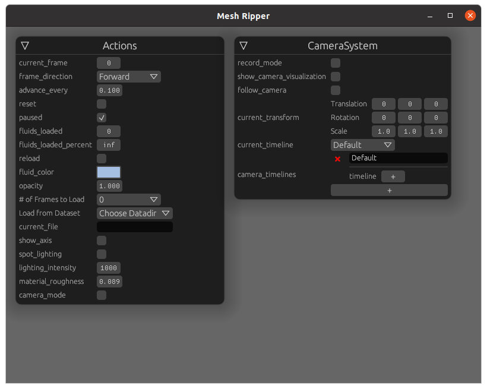

# Mesh Ripper

Rips Meshes

This is a a mesh series viewer for output from fluids simulations etc.

This currently only supports obj files. More coming soon.

## Installation / Run
### Windows & MacOSX

Windows and MacOSX binaries are build with CI, but currently largely untested. It has been used on windows. Please test and send any information.

### Linux

At the moment, just clone the repository, and `cargo run`:

```sh
git clone https://github.com/rezural/mesh-ripper.git
cd mesh-ripper
cargo run  --features=native --release --bin mesh-ripper
```

I will publish to cargo when it gets more feature complete.

## File Format Support

Supported formats:
    * Ply
    * Obj
    * Stl
    * (probably gltf, havent tested yet)

## Showcase

Here are a couple of videos showing the performance, and capabilities of mesh-ripper:

[Fluid in a box](https://youtu.be/AHtn9A5XsTw)

This shows the camera pose recording system.

[Strange Attractors](https://youtu.be/l4Q5ClC5F44)

Particle attractor system being visualized.

## Usage / Keybindings

Currently, data needs to go within assets/data of where the binary is (or the source directory if running with cargo run).

Mesh Ripper will walk the directories found within, allowing you to choose one from the `Load From Dataset` option.



Once you select a dataset that contains ply, obj, or stl files, ordered by number (alphanumeric ordering), Mesh Ripper will load 100 files from this directory, spread across the available files.

Select a higher `# of Frames to Load` to load more files. See algorithm for the LOD file loading.

### Camera

The camera is initially unlocked, press the Left mouse button to enter into game/fly mode. Press Esc to unlock the mouse.

Mesh Ripper uses a FPS style, Mouse look system.

W A S D to move around.

Q & E to move up and down.

CTRL-R to reset camera on the current mesh.

### Play

Press spacebar to play, or Disable the paused checkbox in actions.

Press T & B to set to play forward, and backwards. Or select the appropriate `frame_delay` in actions.

Press R to reset to the first frame. Or select the `pause` checkbox in actions.

Press F & G to increase & decrease the frame rate, or click and drag `advance_every` in actions

When paused, press <- and -> keys to retreat and advance.

### Visualization Settings

The mesh color can be set from the `mesh_color` in actions.

Enable `spot_lighting` to setup brighter lights, and set the lighting_intensity appropriately.

Change the `material_roughness` to make reflections 'fuzzier'.

## Camera Mode

Select `record_mode` in the CameraSystem pane. Please note that this will force a load of every frame available, which may take a long time, and/or cause Mesh Ripper to become laggy, if it exhausts available RAM on the GPU.

This is a limitation, but will be fixed in the near future.

When playing, or paused, orient the camera to where you want the camera pose to be at that frame, and press C to save it at that point in time.

I tend to pause, move to the right frame using <- and ->, orient correctly, and then repeat.

Select `show_camera_visualization` option, to show the orientation of each recorded camera pose, and the interpolated camera between these frames.

Select `follow_camera` to follow the camera at it's interpolated position at each frame.

You can add any number of camera timelines, and select the current one using `current_timeline`

You can see the available `camera_timelines`, where you can remove individual cameras by clicking on the X.

## Saving settings and camera poses

CTRL-S will save a mr-config.ron, and mr-camera-config.ron file to the data directory currently chosen.

## TODO

- [ ] CTRL-R & actions settings to center camera on current mesh
- [ ] Publish to cargo
- [ ] Better Mouse/Camera System (FPS & Orbit)
- [ ] Show available frames in a horizontal bar. ability to select start and end frames (per camera?). Scrobbing.
- [ ] Support for points from stl, ply, vtk, obj
  - [ ] Visualization of points with spheres & arrows where there is velocity & acceleration data
  - [ ] Look into shader to do same
- [ ] Profiling code, debugging is flakey so profiling code goes a long way to be able to println debug
- [ ] Ability to load files outside of assets
- [ ] Arbitrary nesting of directories to select from, ability to select more than one series
- [ ] Ability to load more than one static files (i.e. landscape)
- [ ] File picking dialog
- [ ] Allow to set via actions the initial load LOD
- [ ] Moving mouse on advance_every should increase in .01 - .0025 increments
- [ ] Move to smooth-bevy-cameras
- [ ] Look towards some point on the mesh (or center of mesh, expensive though) on startup, a little above, in front 
- [ ] Release mouse when focus lost
- [ ] More file format support (3d meshes) like vtk, gltf et al. (Currently stl, ply, obj)
- [ ] Load and cache from urls
- [X] Save/load from config directory
- [X] Recording Camera locations & Interpolation
- [X] Add lights
- [x] When a lod is chosen that is not directly above the current lod, load the next lod, then the next higher etc, otherwise you get speedup at the start (the files that have been loaded), and jumpy framerate
- [x] Pause/Forward/Back -> Forward/Back & separate Pause
- [x] Esc to get out of mouse mode
- [x] show first frame on startup
- [x] Better Loading of assets


## BUGS
- [ ] camera follows mouse on load

## Architecture TODO
- [ ] Architecture needs cleanup / rethink
- [ ] Document what needs to be done:
  - [ ] 

## Asset Loading

Mesh Ripper will automatically load 100 files by default. Pass the -l, or --load-max option to change this.

### Loading Algorithm

Mesh Ripper automaticically sorts file alphanumerically. They should load in order, assuming a nice naming & ordering system.

Say you have 100 files like so:

```
[0.obj, 1.obj, 2.obj, 3.obj, 4.obj, 5.obj, 6.obj, 7.obj, 8.obj, 9.obj, 10.obj, 11.obj, 12.obj, 13.obj, 14.obj, 15.obj, 16.obj, 17.obj, 18.obj, 19.obj, 20.obj, 21.obj, 22.obj, 23.obj, 24.obj, 25.obj, 26.obj, 27.obj, 28.obj, 29.obj, 30.obj, 31.obj, 32.obj, 33.obj, 34.obj, 35.obj, 36.obj, 37.obj, 38.obj, 39.obj, 40.obj, 41.obj, 42.obj, 43.obj, 44.obj, 45.obj, 46.obj, 47.obj, 48.obj, 49.obj, 50.obj, 51.obj, 52.obj, 53.obj, 54.obj, 55.obj, 56.obj, 57.obj, 58.obj, 59.obj, 60.obj, 61.obj, 62.obj, 63.obj, 64.obj, 65.obj, 66.obj, 67.obj, 68.obj, 69.obj, 70.obj, 71.obj, 72.obj, 73.obj, 74.obj, 75.obj, 76.obj, 77.obj, 78.obj, 79.obj, 80.obj, 81.obj, 82.obj, 83.obj, 84.obj, 85.obj, 86.obj, 87.obj, 88.obj, 89.obj, 90.obj, 91.obj, 92.obj, 93.obj, 94.obj, 95.obj, 96.obj, 97.obj, 98.obj, 99.obj, 100]
```

and you pass `-l 20`. Mesh Ripper will load 20 files.obj, spread across the input files passed to the executable. Which would be:

```
[0.obj, 5.obj, 10.obj, 15.obj, 20.obj, ...]
```

If you select the next level of `# of Frames to Load`, then it will load each file at the the midpoint from each of the originally loaded files, and load each of those files, resulting in almost the same again loaded. Select the next level again, then it will load approx the same as have been loaded in total again. It tries to load the files so that you can get an overview of your dataset easily, from start to finish.

So for 100 files, starting at 10, the levels available will be:

[10, 19, 37, 69, 100]